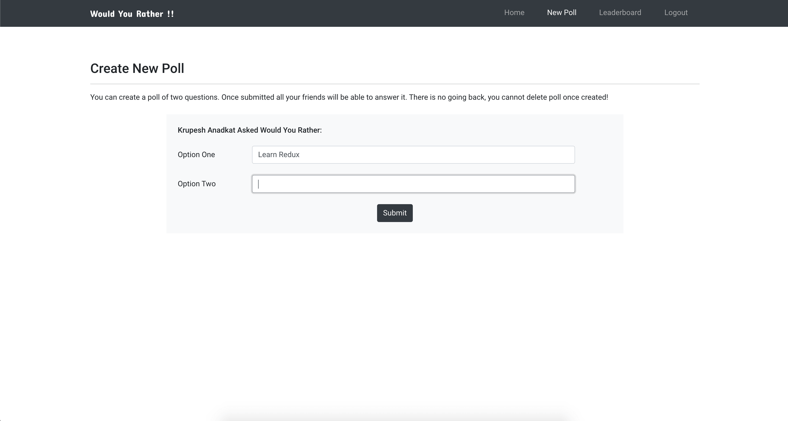

##  Would You Rather - React & Redux Nanodegree Second Project

[Live Code Sandbox Demo](https://jxspo.csb.app/login)

### 📜 Project Overview

In the "Would You Rather?" Project, we'll build a web app that lets a user play the “Would You Rather?” game. The game goes like this: A user is asked a question in the form: “Would you rather [option A] or [option B] ?”. Answering "neither" or "both" is against the rules.

In our app, users will be able to answer questions, see which questions they haven’t answered, see how other people have voted, post questions, and see the ranking of users on the leaderboard.

### 🕹 Project Features

1. Login User
2. Register New User
3. View Answered & Unanswered Poll
4. Participate in Poll Voting 
5. View Rank in Leaderboard
6. Route Protection
7. Route Redirecting

### ⛳️ Routes

**Route Gaurding** or **Route Protection** is in place for all routes, following is the route visibility:

| Normal User                | Authenticated User                     |
|----------------------------|----------------------------------------|
| `/login` Login Route       | `/` Dashboard Route                    |
| `/register` Register Route | `/add` Create New Poll                 |
| `*` 404 Not Found          | `/leaderboard` Leaderboard             |
|                            | `/questions/:question_id` Poll Details |
|                            | `*` 404 Not Found                      |

**Route Redirecting** is in place. For example if user tries to visit `/leaderboard` directly from address bar without logging in then he/she will asked to login first and then redirected to initially requested route (`/leaderboard`)

### ⚙️ Installation & Setup

You should have `npm` and `node` installed in your machine, to confirm type `node --version` in terminal. Below are steps to setup project in your system :

1. Clone the `master` branch of this repository
2. Open Terminal in project folder (containing `package.json` file)
3. Run `npm install` and wait for all dependencies to download
4. Finally run `npm start` this will automatically launch application in default browser at `http://localhost:3000`

### 🎬 Project Snapshots

